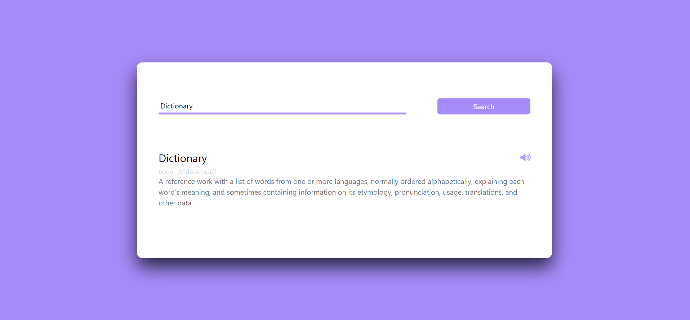

# DictionaryApp
Create a dictionary app using HTML, TailwindCSS And Javascript where you can search for words and it outputs word meaning, word pronunciation, audio pronunciation and usage example.

API Used:https://dictionaryapi.dev/
visit: https://balajisai2003.github.io/DictionaryApp/

